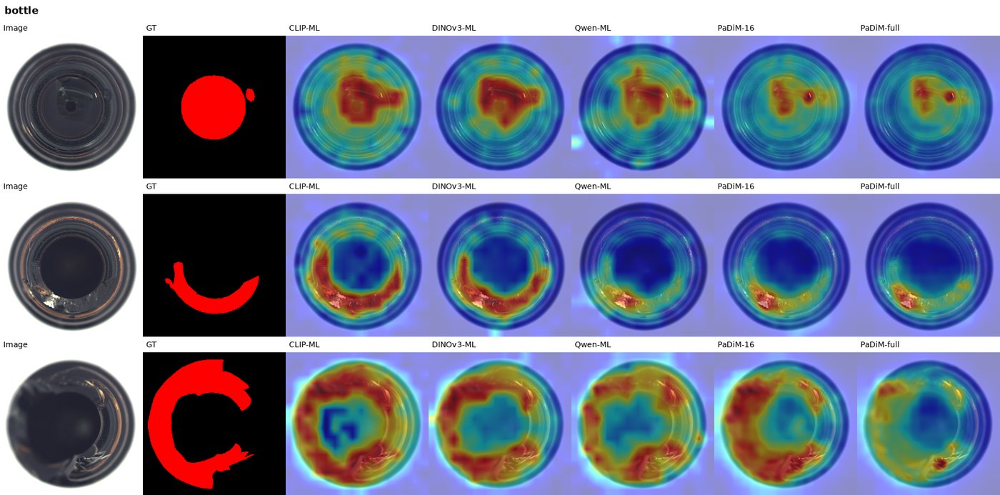
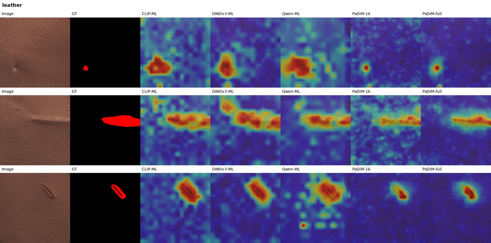
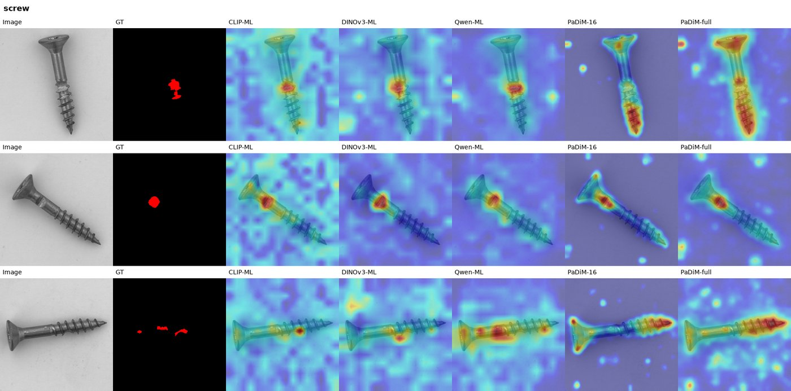

# CloudEdge-abnormal


**主路径**：边侧 **Qwen3.5-0.8B** 视觉塔多层 patch gallery 快检 → 难例上云 → Qwen3-VL(+LoRA) JSON 复核。  
**辅路径**：CLIP / DINOv3 gallery、Anomalib PaDiM（可选 OpenVINO 导出）与像素级对比。

技术栈：Anomalib + OpenVINO/ONNX +（可选）KubeEdge/Sedna + MLflow + FastAPI Web。

## 当前结论（MVTec-15）

### 边侧方法对比（16-shot + 多层 patch + 像素级）

特征法：**多层 mid→late patch-token NN → 距离图 → softmax 加权融合**（图像分 = map max）；像素指标在 256×256。

| Method | Image-AUROC | Pixel-AUROC | Pixel-F1 | Peak MB |
|--------|-------------|-------------|----------|---------|
| **DINOv3-ML** `[12,16,20,24]` | **0.9756** | **0.9716** | **0.5449** | 2352 |
| CLIP-ML `[12,16,20,24]` | 0.9681 | 0.9670 | 0.5350 | 1211 |
| PaDiM ResNet18（全量 good） | 0.9145 | 0.9666 | 0.5003 | 193 |
| Qwen-ML `[6,8,10,12]` pre-merge | 0.9378 | 0.9450 | 0.4339 | 217 |
| PaDiM 16-shot | 0.8164 | 0.9391 | 0.4389 | 193 |


**选型（默认边侧 = Qwen-ML）**：同族易与云端 Qwen-VL 对齐、峰值约 0.2GB；精度上限可换 DINOv3/CLIP-ML；极致轻量 / OpenVINO 可回退 PaDiM-full；PaDiM-16shot 仅作公平对照。

#### 可视化样例

列顺序：Image | GT | CLIP-ML | DINOv3-ML | Qwen-ML | PaDiM-16 | PaDiM-full（更多见 `asserts/edge_mlpatch/`）。

**bottle**（物体类）



**leather**（纹理类）



**screw**（难例）



### 混合协同（边侧 PaDiM + 云端 VLM LoRA）

| Scheme | Mean F1 (15 类) |
|--------|-----------------|
| B1 边侧-only | 0.9285 |
| Zero-shot Qwen3-VL-8B | 0.8898 |
| LoRA 4B | 0.9255 |
| LoRA 8B | 0.9261 |

报告：`outputs/hybrid_lora_8b/all_categories.md`、`outputs/reports/mvtec_mean.md`。

---

## 环境

```bash
# Anomalib / PaDiM / DINOv3 AD
conda activate dinov3

# Web / Qwen3-VL / Qwen3.5 vision / CLIP（本机常用 clip env）
conda activate clip   # 或 base；需 transformers≥4.57 + safetensors
```

权重默认在 `/data2/zlt/anomaly_detection_llm/model_card/`：

- `clip-vit-large-patch14`
- `dinov3-vitl16-pretrain-lvd1689m`
- `Qwen3.5-0.8B`（仅用视觉塔）
- `Qwen3-VL-4B-Instruct` / `Qwen3-VL-8B-Instruct`

数据：`datasets/mvtec` → MVTec-AD。

---

## Web 控制台

```bash
conda activate clip   # transformers>=5.3（RouteAgent）+ 原有 VLM
cd /data2/zlt/code/CloudEdge-abnormal
CUDA_VISIBLE_DEVICES=0 WEB_VLM_DEVICE=cuda:0 WEB_ROUTE_DEVICE=cuda:0 \
  python -m uvicorn web.app:app --host 0.0.0.0 --port 7860
```

浏览器：`http://<host>:7860`

- 总览 / 指标：15 类 B1 / 零样本 / LoRA  
- **实时网络波形**：Demo 页顶部可选 `good/fair/weak/outage`，RTT/带宽/丢包滚动刷新  
- 协同演示：边侧分数 → **Qwen3.5 RouteAgent** → 网络仿真 → 云端 LLM；Anomalib 热力图仅作对比  
- LLM Cases：`hybrid_lora_8b` 难例复核  

Demo 可勾选「Use Qwen3.5 RouteAgent」；首次建议点 **Preload RouteAgent**。带 `[LLM]` 标记的样本有云端缓存 JSON。

---

## 边侧默认：Qwen3.5-0.8B（多层 patch）

配置：`configs/edge_qwen35.yaml` / `configs/default.yaml`（`edge.method: qwen35`）。

```bash
conda activate clip   # transformers + safetensors
CUDA_VISIBLE_DEVICES=0 python -m edge.infer \
  --config configs/edge_qwen35.yaml \
  --image datasets/mvtec/bottle/test/broken_large/000.png \
  --category bottle
# 可选：--method clip|dinov3|padim
```

统一协议：`train/good` → gallery（默认 16-shot）；`test/*` → 评测。  
默认层：Qwen `[6,8,10,12]`（merger 前）；CLIP/DINO `[12,16,20,24]`；`--fusion-temp 0.5`。

```bash
# 像素指标 + 逐类对比图
CUDA_VISIBLE_DEVICES=2 python scripts/bench_edge_pixel_viz.py \
  --methods qwen35 --categories all --max-gallery 16 \
  --fusion-temp 0.5 --tag mlpatch16_all15 --shard qwen --skip-viz
# 对比 CLIP / DINOv3 / PaDiM 见 scripts/bench_edge_pixel_viz.py
```

核心代码：`edge/infer.py`、`edge/methods/encoders.py`、`patch_gallery_ad.py`。

---

## 边侧可选：Anomalib PaDiM

```bash
conda activate dinov3

# 训练边侧 PaDiM + 云端 PatchCore
CUDA_VISIBLE_DEVICES=0 python scripts/train_anomalib.py \
  --config configs/default.yaml --device cuda:0 --category all --no-export --skip-existing

# B0 / B1 / S
CUDA_VISIBLE_DEVICES=0 python scripts/bench_anomalib.py \
  --config configs/default.yaml --device cuda:0 --category all

# 边云网络剖面（good/fair/weak/outage，时延记账 + 上云失败回退边侧）
CUDA_VISIBLE_DEVICES=0 python scripts/bench_network_profiles.py \
  --config configs/default.yaml --device cuda:0 --category bottle

# 16-shot 公平对照
CUDA_VISIBLE_DEVICES=0 python scripts/bench_padim_kshot.py \
  --shots 16 --seed 42 --categories all --device cuda:0 --tag padim16shot
```

网络剖面由 `collab.network.profile` 配置（`good|fair|weak|outage|custom`），实现见 `src/network_sim.py`。弱网时难例上云失败则边侧本地决策，`M4` 业务保持率计为 1.0，并另报 `cloud_upload_success_rate`。

产物：`outputs/anomalib/<cat>/`、`outputs/reports/mvtec_mean.md`、`outputs/reports/network_sim/`。

---

## 混合：边侧快检 + 云端 Qwen-VL

默认边侧推理用 Qwen0.8B（`python -m edge.infer`）。下列 hybrid 脚本仍可复用已缓存的 Anomalib PaDiM 分数做离线路由评测。

```bash
# 0) 在线边侧（默认 Qwen3.5-0.8B vision AD + Qwen3.5 RouteAgent 是否上云）
# 需要 transformers>=5.3（clip 环境已升）；--no-route-agent 可关掉路由大脑
conda activate clip
CUDA_VISIBLE_DEVICES=0 python -m edge.infer \
  --image datasets/mvtec/bottle/test/broken_large/000.png --category bottle
CUDA_VISIBLE_DEVICES=0 python -m edge.infer \
  --image datasets/mvtec/bottle/test/broken_large/000.png --category bottle \
  --network-profile outage

# 路由智能体剖面对比（heuristic vs RouteAgent × good/fair/weak/outage）
CUDA_VISIBLE_DEVICES=0 python scripts/bench_route_agent.py \
  --config configs/default.yaml --category bottle --max-samples 24

# 1) 导出边侧分数（Anomalib PaDiM 缓存，可选）
conda activate dinov3
CUDA_VISIBLE_DEVICES=0 python scripts/export_edge_scores.py \
  --config configs/hybrid.yaml --category bottle

# 2) 零样本 / LoRA 云端复核（hybrid 可启用 collab.route_agent + network 仿真）
conda activate clip   # 或 base
CUDA_VISIBLE_DEVICES=0 python scripts/bench_hybrid.py \
  --config configs/hybrid.yaml --category bottle

CUDA_VISIBLE_DEVICES=0 python scripts/bench_hybrid_multi.py \
  --config configs/hybrid_lora_8b.yaml \
  --categories bottle,screw,cable --max-cloud-reviews 16 --device cuda:0
```

### LoRA 微调（OK/NG JSON）

```bash
conda activate base
python scripts/build_vlm_sft_data.py --config configs/qwen_vl_lora.yaml
CUDA_VISIBLE_DEVICES=0 python scripts/train_qwen_vl_lora.py --config configs/qwen_vl_lora.yaml
CUDA_VISIBLE_DEVICES=0 python scripts/eval_qwen_vl_lora.py --config configs/qwen_vl_lora.yaml --max-images 60

# 8B
python scripts/train_qwen_vl_lora.py --config configs/qwen_vl_lora_8b.yaml
```

产物：`outputs/qwen_vl_lora*/adapter/`、`outputs/hybrid_lora*/`。

可选双 VLM（边 4B / 云 8B）：`configs/qwen_vl.yaml` + `scripts/bench_qwen_vl.py`（**非**当前 hybrid 主路径）。

---

## 目录

```text
configs/                 # default / hybrid / hybrid_lora* / qwen_vl*
scripts/
  train_anomalib.py      # 边/云 Anomalib 训练
  bench_anomalib.py      # B0/B1/S
  bench_network_profiles.py # 弱网剖面对比（good/fair/weak/outage）
  bench_route_agent.py   # Qwen3.5 上云路由智能体对比
  bench_edge_pixel_viz.py # 多层 patch + 像素指标 + 对比可视化
  bench_edge_methods.py  # 旧版 CLS-gallery 对比
  bench_padim_kshot.py   # PaDiM k-shot
  export_edge_scores.py / bench_hybrid*.py
  train_qwen_vl_lora.py / eval_qwen_vl_lora.py
edge/
  methods/               # encoders / patch_gallery_ad / pixel_metrics / viz
  infer.py / vlm_infer.py
cloud/                   # 云端复核
web/                     # FastAPI 控制台
src/vlm/                 # Qwen-VL 客户端 / Qwen3.5 RouteAgent / 路由
models/                  # open_clip / dino 工具（辅助）
asserts/edge_mlpatch/    # README 用可视化样例（jpg）
outputs/reports/         # 汇总指标
deploy/kubeedge/         # 部署骨架
datasets/mvtec           # 数据软链
# docs/ 与赛题 PDF 仅本地保留，已 gitignore，不上传
```

---

## 说明

- **默认边侧 = Qwen3.5-0.8B ML-patch**（轻量、与云端同族）；DINOv3/CLIP 精度更高但显存更大；PaDiM-full 仍可作极致轻量备选（~0.19GB）。  
- VLM **不出热力图**；Web 上 Cloud PatchCore 条带仅为传统 AD 对比。  
- 内存 / 时延以目标边缘硬件（OpenVINO 等）复测为准；桌面 GPU 数字仅作开发参考。  
- KubeEdge 真集群不阻塞本阶段指标；难例路由先验证协同收益。
